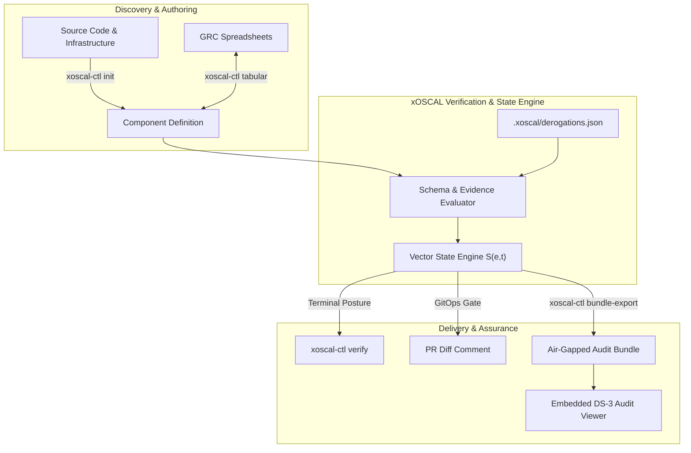

# xOSCAL

<p align="center">
  <picture>
    <source media="(prefers-color-scheme: dark)" srcset="https://shieldcn.dev/header/graph.svg?title=xOSCAL&subtitle=High-Assurance+NIST+OSCAL+Engine+%26+CLI&logo=shield&theme=zinc&mode=dark" />
    
  </picture>
</p>

<p align="center">
  <a href="https://github.com/ckodex-labs/ckodex-xoscal/releases"></a>
  <a href="https://github.com/ckodex-labs/ckodex-xoscal/actions/workflows/ci.yml"></a>
  <a href="https://github.com/ckodex-labs/ckodex-xoscal/blob/main/LICENSE"></a>
  <a href="https://github.com/ckodex-labs/ckodex-xoscal/commits/main"></a>
  <a href="https://github.com/ckodex-labs/ckodex-xoscal/stargazers"></a>
</p>

<p align="center">
  <a href="https://pages.nist.gov/OSCAL/"></a>
  <a href="https://go.dev/"></a>
  <a href="https://dagger.io/"></a>
  <a href="https://slsa.dev/"></a>
  <a href="#6-offline-air-gapped-audit-bundles-xoscal-ctl-bundle-export"></a>
  <a href="https://github.com/MChorfa/shieldcn-zig"></a>
</p>

---

> **xOSCAL** is a high-assurance, developer-friendly compliance engine and unified CLI for [NIST OSCAL 1.2.3](https://pages.nist.gov/OSCAL/). It eliminates compliance theater by translating infrastructure and codebases into machine-verifiable governance artifacts, multi-dimensional vector state, GitOps pull-request diffs, spreadsheet round-trips, and air-gapped cryptographic bundles.

---

## ⚡ Capability Matrix

| Capability | Persona | Problem Solved | Unified Command |
| :--- | :--- | :--- | :--- |
| **Day-0 Scaffolding** | App Developers | Auto-detects stack (Go, Python, Docker, K8s), synthesizes URNs to UUIDv5, generates schema-valid OSCAL | `xoscal-ctl init` |
| **Vector State Verification** | Security Engineers | Replaces binary pass/fail with formal state vector $\mathbf{S}(e,t) = \langle P,V,A,C,E,L,\tau \rangle$, sidecar digests, and tamper gating | `xoscal-ctl verify` |
| **GitOps PR Diffing** | Tech Leads / DevOps | Detects control drift, regressions, and deletions in CI with formatted Markdown for PR comments | `xoscal-ctl diff` |
| **Spreadsheet Synchronization** | GRC Analysts | Bi-directional OSCAL $\leftrightarrow$ CSV/Excel round-trip with strict schema enforcement | `xoscal-ctl tabular` |
| **Rule 23 Derogation Lifecycle** | CISOs / Risk Officers | Time-bounded risk acceptances with strict TTLs, justifications, and compensating controls | `xoscal-ctl derogate` |
| **Air-Gapped Audit Bundles** | 3PAO / SCIF Auditors | Immutable `.tar.gz` bundle with embedded zero-dependency offline WebCrypto viewer | `xoscal-ctl bundle-export` |

---

## 🚀 Quickstart

### Build Standalone Binaries

```bash
# Compiles bin/xoscal-server and bin/xoscal-ctl locally
make build

# Inspect the CLI suite
./bin/xoscal-ctl help
```

---

## 📖 Workflows by Persona

### 1. Developer Onboarding (`xoscal-ctl init`)
Scan a repository and generate a schema-valid OSCAL 1.2.3 `ComponentDefinition` in seconds without hand-authoring raw UUIDs or XML/JSON:

```bash
xoscal-ctl init --framework nist-sp-800-53-rev5
```

<details>
<summary><b>View Execution Output</b></summary>

```text
🔍 Scanning repository at: . ...
[OK] Detected Project: my-service (Languages: [Go], Docker: true, K8s: true, TF: false)
[OK] Mapped 2 component(s) using virtual URNs -> deterministic UUIDv5
[OK] Verified compliance with official NIST OSCAL 1.2.3 JSON schema
[OK] Created workspace config: .xoscal/xoscal.yaml
[OK] Emitted component definition: component-definition.json (3907 bytes)

Next step: Run 'xoscal-ctl verify' to check control posture.
```
</details>

---

### 2. Continuous Verification & Vector Posture (`xoscal-ctl verify`)
Verify compliance against the embedded official NIST JSON schema and calculate the formal state vector:

$$\mathbf{S}(e,t) = \langle \text{Presence}, \text{Valence}, \text{Anti-Conflict}, \text{Coherence}, \text{Evidence}, \text{Lifecycle}, \tau \rangle$$

```bash
# Verify controls and evidence sidecars
xoscal-ctl verify --file component-definition.json

# Emit machine-readable Vector State for automated admission gates
xoscal-ctl verify --file component-definition.json --json
```

<details>
<summary><b>View Posture Terminal Table</b></summary>

```text
=== xOSCAL GOVERNANCE VECTOR POSTURE ===
Artifact:  component-definition.json (component-definition)
Timestamp: 2026-09-23T21:51:13Z

Vector Product: S(e,t) = <P=PRESENT, V=POSITIVE, A=0, C=COHERENT, E=VERIFIED, L=NORMAL>

Operational Posture: NORMAL (Coherence: COHERENT)
Controls Summary:    7 Total | 7 Passing | 0 Degraded | 0 Derogated | 0 Anti-Conflicts

CONTROL        COMPONENT            POSTURE          DESCRIPTION / REMEDIATION
-------------------------------------------------------------------------------------
ac-2           my-service Core      PASS             Account management implemented v...
ia-2           my-service Core      PASS             Identification & authentication ...
sc-7           my-service Network   PASS             Boundary protection validated    
```
</details>

---

### 3. GitOps PR Compliance Diff (`xoscal-ctl diff`)
Run in GitHub Actions or GitLab CI to catch control drift, deletions, and posture regressions between git branches before merging:

```bash
# Generate Markdown table for PR comment / $GITHUB_STEP_SUMMARY
xoscal-ctl diff \
  --base main.component-definition.json \
  --head component-definition.json \
  --markdown \
  --fail-on-regression
```

<details>
<summary><b>View Markdown Diff Output</b></summary>

| Status | Control ID | Component | Title | Change Details |
| :--- | :--- | :--- | :--- | :--- |
| **ADDED** | `ac-3` | `my-service Core` | Access Enforcement | New control implementation introduced |
| **MODIFIED** | `ac-2` | `my-service Core` | Account Management | Description updated; evidence renewed |
| **REMOVED** | `sc-7` | `my-service Core` | Boundary Protection | ⚠️ Control removed from component |

</details>

---

### 4. GRC Spreadsheet Bridge (`xoscal-ctl tabular`)
Export nested OSCAL controls into flat RFC-4180 CSV tables for non-technical auditors, and re-import spreadsheet responses back into valid OSCAL with automated schema verification:

```bash
# Export controls to CSV for spreadsheet editing
xoscal-ctl tabular export --in component-definition.json --out controls.csv

# Import edited responses back into schema-valid OSCAL JSON
xoscal-ctl tabular import \
  --in controls.csv \
  --base component-definition.json \
  --out component-definition.updated.json
```

---

### 5. Rule 23 Derogation Lifecycle (`xoscal-ctl derogate`)
Enforces **Constitutional Rule 23**: *"Accepted risk does not rewrite history."* Teams record formal, time-bounded risk acceptances with strict TTL expirations and compensating controls rather than deleting controls:

```bash
# Register a time-bounded risk exception
xoscal-ctl derogate add \
  --control sc-8 \
  --scope service:internal-worker \
  --authority urn:xoscal:authority:ciso-alex \
  --reason "Internal worker in isolated VPC without external egress" \
  --ttl-days 30 \
  --compensating "sc-7 boundary enforcement, au-2 audit logging"

# Inspect active exceptions and remaining TTLs
xoscal-ctl derogate list
```

*Active derogations transition controls to `SAFE_HOLD` without failing CI. When a TTL lapses, the control transitions to `EXPIRED`, registers an anti-conflict, and blocks the build.*

---

### 6. Offline Air-Gapped Audit Bundles (`xoscal-ctl bundle-export`)
Export self-contained `.tar.gz` packages for air-gapped SCIF environments and third-party auditors with zero external dependencies:

```bash
xoscal-ctl bundle-export \
  --in component-definition.json \
  --evidence-dir ./evidence \
  --out audit-bundle.tar.gz
```

- **Cryptographic Packaging**: Bundles canonical OSCAL JSON files, evidence blobs with SHA-256 sidecars, and a signed `manifest.json`.
- **Zero-Dependency Offline Viewer**: Bundles an embedded `audit_viewer.html` styled with CKODEX-DS-3 editorial tokens that verifies SHA-256 digests in-browser using the native W3C WebCrypto API—requiring no local server, runtime, or network access.

---

## 🏛️ System Architecture



---

## ⚙️ Enterprise gRPC Service (`xoscal-server`)

For enterprise environments requiring centralized control storage, full-text search, and knowledge graph mapping:

```bash
# Run gRPC server backed by embedded SQLite
./bin/xoscal-server -dsn oscal.db

# Inspect service reflection
grpcurl -plaintext localhost:50051 list
```

---

## 🛠️ Verification Ladder & CI/CD

Every commit is strictly verified by our hermetic **[Dagger](https://dagger.io/)** pipeline and local test ladder:

```bash
make build        # Compiles bin/xoscal-server and bin/xoscal-ctl
make test         # Runs all unit & conformance tests
make test-race    # Executes Go race detector across all packages
make lint         # Runs buf lint, go vet, and gofmt
python3 scripts/design-lint.py  # Enforces CKODEX-DS-3 editorial constraints
python3 scripts/a11y-lint.py    # Enforces WCAG 3.0 static accessibility checks
```

- **Hermetic Dagger Suite**: Parallel execution of linters, security scans (gosec, govulncheck), Metaschema constraint checking (`oscal-cli`), and air-gap badge bundling.
- **Badge Engine**: Powered by **[shieldcn-zig](https://github.com/MChorfa/shieldcn-zig)** (pure-Zig, zero external rendering dependencies, SLSA Level 3).

---

## 📄 License

Apache License 2.0. See [LICENSE](LICENSE) for details.
